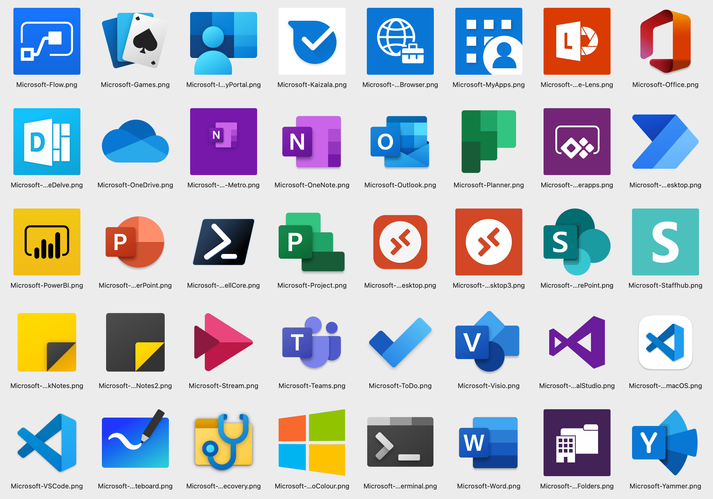
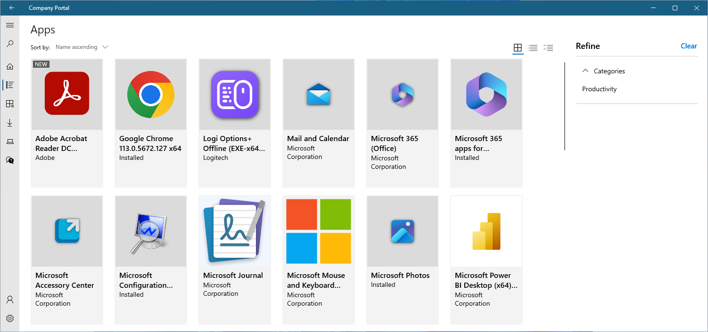

# Application Icons for Microsoft Intune

A set of application icons for Windows, macOS, Android and iOS platforms for use when adding applications to Microsoft Intune or Microsoft Endpoint Configuration Manager (or other device management / MDM and application deployment solutions).

Icons have been added in their largest size and best possible quality. All icons have been optimised for size using [PNGOUT](http://advsys.net/ken/util/pngout.htm).

## Usage

Self-service applications are displayed in the Intune Company Portal app or at the [Microsoft Intune Web Company Portal](https://portal.manage.microsoft.com/) for install. Using high quality product icons ensures users see a familiar interface when accessing these applications.

## Microsoft Store app icons

Microsoft has updated Store apps integration with Microsoft Intune (see [Add Microsoft Store apps to Microsoft Intune](https://learn.microsoft.com/en-us/mem/intune/apps/store-apps-microsoft)); however, app icons are missing when adding Store apps this way.

Until Microsoft fixes this, this repository will include icons for Store-based apps that can be imported into Intune. If you would like to see additional icons for more apps, fork this repo, update [StoreApps.txt](StoreApps.txt) create a pull request to have the app icon imported. StoreApps.txt must include the application name as it appears in the [Microsoft Store](https://apps.microsoft.com/store/apps). Each app must be listed on a new line.

## Intune Company Portal icons

A set of icons have also been resized to look better in the Intune Company Portal. The icons canvas size has been resized to provide more space around the icon and broadly align to icons that appear in the Microsoft Store.

Below is an example of the Intune Company Portal showing Microsoft Store and Win32 applications with consistent icons providing a more visual appealing experience.

## License

[![License][license-badge]][license]

This repository is licensed with an MIT license; however, the icons themselves remain the property of their respective software vendors.

[license-badge]: https://img.shields.io/github/license/aaronparker/icons.svg?style=flat-square
[license]: https://github.com/aaronparker/icons/blob/main/LICENSE
